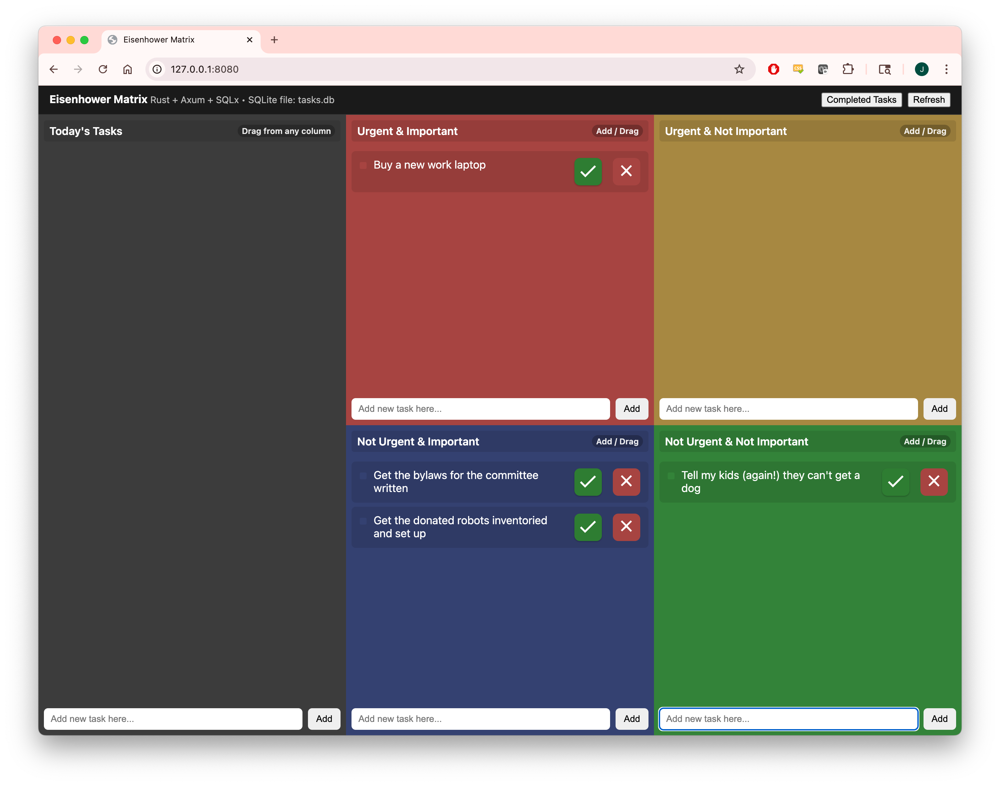

# EISENPOWER - Eisenhower Matrix with a current-day priority list : Rust + Axum + SQLite (+ optional Docker)

This is a modified form of the Eisenhower Matrix method for creating TODO lists according to urgency and important. I also created another panel for ordering the tasks that are currently on the docket for the day/week.

Several years ago I developed a version of this in Swift for MacOS and iOS, but that wasn't portable across devices, and wasn't web accessible. It also didn't track completed items and allow you to pull them out of the completed bin if you realized you weren't done yer.

Here are some of the features

- Drag & drop between columns to reorder/move.
- When dragging to the Today's Task list, it preserves which category it came from, in case you want to move it back to where it came from.
- Add tasks via the input at the bottom of each column.
- Click a task's text to edit. Automatically saved when navigating away.
- Checkmark button to indicate the task is done and move it to the Completed Tasks list
- X button to delete a task entirely.
- In the Completed Tasks panel, click the restore button to move the item back to the list of items still needing to be done.
- Data lives in a local file `tasks.db` (created automatically for the docker image, and the git repository contains and empty tasks.db with all the right tables).
- Requires rudimentary HTTP auth to log in (default username is 'admin' and default password is 'password'). These can be changed via the docker-compose.yml file or environment variables.

## Screenshots



## How to Run
To run from the command line:
```
cargo run
```
OR
```
cargo run --release
```

To run by creating a docker image and container
```
docker compose up --build
```

Then open http://127.0.0.1:8080  (or whatever IP address you chose and whatever IP you chose, if using docker)

Enjoy!


